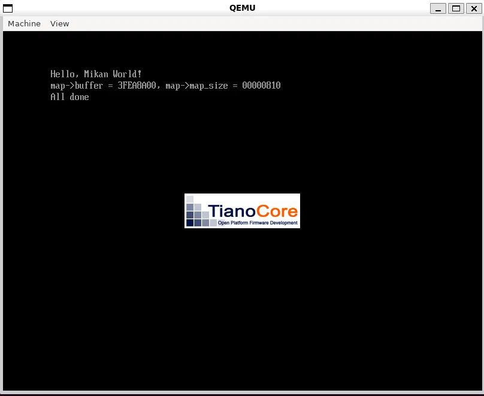
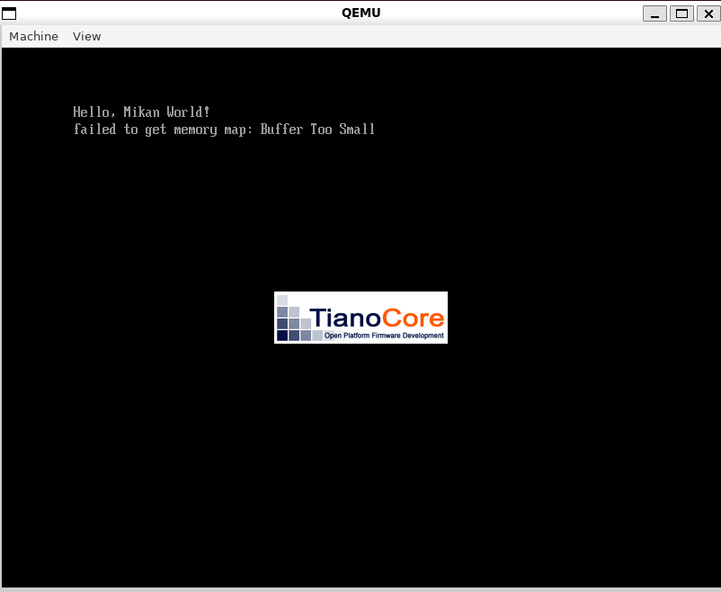

# 第2章 EDK II入門とメモリマップ

## 環境
| 項目 | 値 |
|---|---|
| ACTIVE_PLATFORM | MikanLoaderPkg/MikanLoaderPkg.dsc |
| TARGET | DEBUG |
| TARGET_ARCH | X64 |
| TOOL_CHAIN_TAG | CLANG38 |
| clang | Ubuntu clang 14.0.0 |

- `CLANG38` は「clang 3.8以降」を意味するEDK II側の設定名。実際に使われるのは clang 14 でも問題ない。

## ディレクトリ構成
- 自分で書くコード（`MikanLoaderPkg`）の実体はリポジトリ側に置き、EDK II側からシンボリックリンクで参照する。
```bash
  cd /root/edk2
  ln -s /root/mikanos-observatory/MikanLoaderPkg ./
```
- 設定ファイル（.dec / .dsc / .inf）は公式リポジトリの該当段階からコピーし、`Main.c` は自分で書く。

---

## 2a: EDK IIでLoader.efiを作る

### EDK IIとは
- UEFIアプリを作るための **ライブラリ集とビルドの仕組み**。
- QEMUで使っているファームウェア（OVMF）自体もEDK IIで作られている。

### パッケージを構成するファイル
| ファイル | 役割 |
|---|---|
| `MikanLoaderPkg.dec` | パッケージの宣言 |
| `MikanLoaderPkg.dsc` | ビルドの設定（どのライブラリを使うか等） |
| `Loader.inf` | ビルドするモジュールの定義（ソースファイル、エントリーポイント名等） |
| `Main.c` | プログラム本体 |

### .infは「レシピ」であり、実行されるものではない
```
【ビルドのとき】build コマンドが .inf を読む
  Loader.inf ＝ 作り方の指示書
    [Sources]   → Main.c をコンパイルせよ
    [Packages]  → MdePkg のヘッダを使え
    ENTRY_POINT → UefiMain を入口にせよ
        ↓ コンパイル＋リンク
  Loader.efi ＝ 完成品（入口のアドレスがヘッダに書き込まれている）

【実行のとき】ファームウェアは .inf の存在を知らない
  ファームウェア → Loader.efi を RAM に読み込む → 入口のアドレスへジャンプ
```
- `build` は `Conf/target.txt` の `ACTIVE_PLATFORM` に書かれた .dsc を起点にビルドする。

### エントリーポイント
- 入口にする関数名は自由に決められる（第1章は `EfiMain`、第2章は `UefiMain`）。
- 第1章ではビルドのコマンドで、EDK IIでは `.inf` の `ENTRY_POINT` で指定する。
- ファームウェアは関数名を知らない。ビルド時に入口の **アドレス** が .efi（PE形式）のヘッダに書き込まれ、ファームウェアはそれを読んでジャンプする。
- 正確には、EDK IIではライブラリが用意した本当の入口 `_ModuleEntryPoint` が先に実行され、下準備（SystemTableをグローバル変数 `gST` に保存する等）をしてから `UefiMain` を呼ぶ。

### `#include` のファイルはどこから来るか
| ヘッダ | 実物の場所 |
|---|---|
| `<Uefi.h>` | `/root/edk2/MdePkg/Include/Uefi.h` |
| `<Library/UefiLib.h>` | `/root/edk2/MdePkg/Include/Library/UefiLib.h` |

コンパイラがこの場所を知る仕組み:
1. `Loader.inf` の `[Packages]` に `MdePkg/MdePkg.dec` と書かれている
2. `MdePkg.dec` の `[Includes]` に「ヘッダは `Include` フォルダにある」と書かれている
3. build が、コンパイラに `-I /root/edk2/MdePkg/Include` を渡す

### `Print` の正体
- `#include` で取り込むのは宣言だけ。中身（ソース）はEDK II内にあり、ビルド時に一緒にコンパイルされて Loader.efi に組み込まれる（ビルドログの `Building ... MdePkg/Library/...` がそれ）。
- `Print` は文字列を整形したあと、最後は第1章と同じ `ConOut->OutputString` を呼ぶ。実際に文字を描くのは今回もファームウェア。

### ビルド結果
```
- Done -
```
- `make: Nothing to be done` は、前回から変更がないので作り直していないという意味（エラーではない）。

```
$ file Loader.efi
MS-DOS executable PE32+ executable (EFI application) x86-64, for MS Windows
```
- **PE32+**: Windowsの実行ファイル（.exe）と同じ形式。UEFIは.efiの形式としてPEを採用している。
- **MS-DOS executable**: PE形式は先頭が歴史的な理由でMS-DOSヘッダ（`MZ` = `4D 5A`）から始まるため。
- **for MS Windows**: `file` コマンドがPE形式に付けるラベル。本当の種類は **(EFI application)**。

### 実行結果


---

## 2b: メモリマップを取得してファイルに保存する

### メモリマップとは
- RAMを先頭から順に区切った **区画の一覧表**。1行 =「◯番地から△ページ分（1ページ = 4KB）は、この用途」。
- 種類ごとの合計ではない。使用中の区画が飛び飛びにあるため、空き（Type 7）も何度も出てくる。
- OSが知りたいのは「空きが全部で何MBか」ではなく「どこからどこまでを続けて使えるか」。合計は後から足し算で出せるが、区画の情報は合計からは復元できない（ディスクの断片化と同じ構図）。
- **開始アドレス ＋ ページ数 × 4KB ＝ 次の区画の開始アドレス**
  - 例: Index 10 `0x3E859000 + 2 × 0x1000 = 0x3E85B000` = Index 11 の開始

### Main.c の処理（3ステップ）
```
UefiMain
 ① GetMemoryMap       … ファームウェアにメモリマップをもらう（バイナリの配列として）
 ② OpenRootDir + Open … ディスクに "memmap" ファイルを作って開く
 ③ SaveMemoryMap      … 配列を1要素ずつCSVの1行に変換してファイルに書く
```

#### ① メモリマップをもらう
- メモリマップを作って管理しているのはファームウェア。Main.c は `gBS->GetMemoryMap` で「今の状態をこの入れ物に書いて」と頼んでいるだけ（第1章の `OutputString` と同じ「サービスを使う側」の構図）。

| 引数 | 渡すとき | 戻ってきたとき |
|---|---|---|
| `&map->map_size` | 入れ物の大きさ（16KB） | 実際に書き込んだ大きさ（`0x810`） |
| `map->buffer` | 入れ物の先頭アドレス | 区画の情報が並んで書き込まれる |
| `&map->map_key` | — | メモリマップの「版番号」 |
| `&map->descriptor_size` | — | 1区画あたりの大きさ（48バイト） |
| `&map->descriptor_version` | — | 形式のバージョン |

- 入れ物の中身は `EFI_MEMORY_DESCRIPTOR` 構造体の配列（定義は `MdePkg/Include/Uefi/UefiSpec.h`）。
```c
  typedef struct {
    UINT32               Type;           // 種類（7 = 空き など）
    EFI_PHYSICAL_ADDRESS PhysicalStart;  // 開始アドレス
    EFI_VIRTUAL_ADDRESS  VirtualStart;
    UINT64               NumberOfPages;  // ページ数
    UINT64               Attribute;      // 属性
  } EFI_MEMORY_DESCRIPTOR;
```
- CSVの列は、この構造体のメンバーをそのまま書き出したもの。

#### ③ 1行ずつ書き出す
- 入れ物の先頭から `descriptor_size`（48バイト）ずつずらして読む。`0x810 ÷ 48 = 43` 回ループ → 43行。
- 構造体の `sizeof` は40バイトだが、ファームウェアは後ろに拡張分を足してよい仕様のため、**必ず教えられた `descriptor_size` で進む**。

#### ② ファイルを開く
- 「Loader.efi が読み込まれたディスク」をファームウェアの仕組みで探し、そのファイルシステムを開いて `\memmap` を作る。FATの構造を自分で扱っているわけではない。

### 実行結果


```
map->buffer = 3FEA8A00, map->map_size = 00000810
All done
```

<details>
<summary>memmap の全内容（クリックで展開）</summary>

```
Index, Type, Type(name), PhysicalStart, NumberOfPages, Attribute
0, 3, EfiBootServicesCode, 00000000, 1, F
1, 7, EfiConventionalMemory, 00001000, 9F, F
2, 7, EfiConventionalMemory, 00100000, 700, F
3, A, EfiACPIMemoryNVS, 00800000, 8, F
4, 7, EfiConventionalMemory, 00808000, 8, F
5, A, EfiACPIMemoryNVS, 00810000, F0, F
6, 4, EfiBootServicesData, 00900000, B00, F
7, 7, EfiConventionalMemory, 01400000, 3AB36, F
8, 4, EfiBootServicesData, 3BF36000, 20, F
9, 7, EfiConventionalMemory, 3BF56000, 2903, F
10, 1, EfiLoaderCode, 3E859000, 2, F
11, 9, EfiACPIReclaimMemory, 3E85B000, 1, F
12, 4, EfiBootServicesData, 3E85C000, D8, F
13, A, EfiACPIMemoryNVS, 3E934000, 12, F
14, 0, EfiReservedMemoryType, 3E946000, 1C, F
15, 3, EfiBootServicesCode, 3E962000, 10A, F
16, 6, EfiRuntimeServicesData, 3EA6C000, 5, F
17, 5, EfiRuntimeServicesCode, 3EA71000, 5, F
18, 6, EfiRuntimeServicesData, 3EA76000, 5, F
19, 5, EfiRuntimeServicesCode, 3EA7B000, 5, F
20, 6, EfiRuntimeServicesData, 3EA80000, 5, F
21, 5, EfiRuntimeServicesCode, 3EA85000, 7, F
22, 6, EfiRuntimeServicesData, 3EA8C000, 8F, F
23, 7, EfiConventionalMemory, 3EB1B000, 64, F
24, 4, EfiBootServicesData, 3EB7F000, 681, F
25, 7, EfiConventionalMemory, 3F200000, 3, F
26, 4, EfiBootServicesData, 3F203000, 818, F
27, 7, EfiConventionalMemory, 3FA1B000, 1, F
28, 3, EfiBootServicesCode, 3FA1C000, 17F, F
29, 5, EfiRuntimeServicesCode, 3FB9B000, 30, F
30, 6, EfiRuntimeServicesData, 3FBCB000, 24, F
31, 0, EfiReservedMemoryType, 3FBEF000, 4, F
32, 9, EfiACPIReclaimMemory, 3FBF3000, 8, F
33, A, EfiACPIMemoryNVS, 3FBFB000, 4, F
34, 4, EfiBootServicesData, 3FBFF000, 201, F
35, 7, EfiConventionalMemory, 3FE00000, 8D, F
36, 4, EfiBootServicesData, 3FE8D000, 20, F
37, 3, EfiBootServicesCode, 3FEAD000, 20, F
38, 4, EfiBootServicesData, 3FECD000, 9, F
39, 3, EfiBootServicesCode, 3FED6000, 1E, F
40, 6, EfiRuntimeServicesData, 3FEF4000, 84, F
41, A, EfiACPIMemoryNVS, 3FF78000, 88, F
42, 6, EfiRuntimeServicesData, FFC00000, 400, 1
```
</details>

### 観察してわかったこと
1. **行数の予測が一致**: `map_size = 0x810`（2064バイト）÷ 48バイト = 43行。実際も Index 0〜42 の43行。
2. **自分自身が写っている**: Index 10 の `EfiLoaderCode`（`0x3E859000`、8KB）は、今動いている Loader.efi 本体。
3. **バッファはスタック上**: `memmap_buf` は関数内の配列（スタック上）。そのアドレス `0x3FEA8A00` は Index 36（BootServicesData）の範囲内にある → スタック自体がファームウェアの用意した BootServicesData 領域にある。プログラム本体（Index 10）とスタック（Index 36）は別の場所。
4. **RAMの終わり**: Index 41 は `0x3FF78000 + 0x88000 = 0x40000000`（ちょうど1GB）で終わる。RAMの最後の番地は `0x3FFFFFFF`（QEMUの `-m 1G` と一致）。
5. **穴がある**: `0xA0000`〜`0xFFFFF`（384KB）はメモリマップに載っていない。昔のPCの名残で画面表示やBIOS用に予約された領域。
6. **最後の行はRAMではない（おそらく）**: Index 42 の `0xFFC00000`（4MB、Attribute `1` = キャッシュ不可）は、ファームウェアのフラッシュメモリ（OVMF）が見えている領域と考えられる。`0x40000000`〜`0xFFC00000` はRAMが存在しない穴。**アドレスがあるからといって、その先がRAMとは限らない。**

### 種類ごとの合計（1ページ = 4KB）
| Type | 名前 | 合計 | OSから見ると |
|---|---|---|---|
| 7 | ConventionalMemory | 約989MB | 自由に使える |
| 3, 4 | BootServicesCode/Data | 約31MB | ExitBootServices 後は自由に使える |
| 1 | LoaderCode | 8KB | ブートローダー自身。OSの管理下 |
| 5, 6 | RuntimeServicesCode/Data | 約5.6MB（RAM内） | 触ってはいけない |
| 9 | ACPIReclaimMemory | 36KB | ACPIの表を読み終えたら使える |
| A | ACPIMemoryNVS | 約1.6MB | 触ってはいけない |
| 0 | ReservedMemoryType | 128KB | 触ってはいけない |

### 問いと答え

**(a) 入れ物（バッファ）が小さすぎたら？**
- `EFI_BUFFER_TOO_SMALL` が返る。
- このとき帰りの `map_size` に「本当に必要なサイズ」が入って返ってくる。
- → 1回目でサイズを問い合わせ、必要な大きさの入れ物を用意して2回目で取得する、という使い方ができる。

**(b) 取得する行為でメモリマップは変わるか？**
- すでに確保済みの領域（今回のスタック）に書くだけなら変わらない。
- 新しくメモリを確保・解放すると変わる。(a) の2回目のために `gBS->AllocatePool` で入れ物を確保すると、空き区画が分割されて行が1〜2行増える（「鶏と卵」の状態）。
- → 実際のコードでは、少し余裕を持たせたサイズで確保するのが定石。

**この先とのつながり: `map_key`**
- メモリマップが少しでも変わると `map_key`（版番号）も変わる。
- 第3章の `ExitBootServices` は **最新の `map_key` を渡さないと失敗する**。そのため「失敗したらメモリマップを取り直して再度呼ぶ」処理が必要になる。

### 用語の整理

#### スタック
- 関数が動いている間だけ使う一時的な作業用のメモリ領域。ローカル変数や関数の戻り先アドレスが置かれる。
- 関数を呼ぶたびにその関数用の領域が積まれ、終わると片付けられる（後入れ先出し）。
- CPUの `RSP` レジスタが「今の一番上」を指す。x86では積むほどアドレスが小さい方向に伸びる。
- 大きさに限りがある（巨大な配列を置くとスタックオーバーフロー）。関数が終わると中身は無効になる。

| 置き場所 | 何が置かれるか | いつまで存在するか |
|---|---|---|
| スタック | 関数内のローカル変数 | その関数が終わるまで |
| ヒープ（動的確保） | `gBS->AllocatePool` 等で確保したもの | 解放するまで |
| 静的領域 | グローバル変数、プログラム本体 | プログラムが動いている間ずっと |

#### RAMとメモリ
- 単に「メモリ」と言えば RAM（メインメモリ）のこと。電源を切ると消える。
- フラッシュメモリ、ROM、SSDは不揮発の別物。キャッシュやレジスタはCPU内の記憶領域。

---

### 実験: エラー処理を追加して、わざと失敗させる

#### 追加したエラーチェック
本の第2章のコードは、`GetMemoryMap` などの戻り値を確認していない。
`GetMemoryMap` が失敗して `descriptor_size` が 0 のままだと、`SaveMemoryMap` のループが
`iter += 0` で進まなくなり、無限ループになる危険がある。そこで戻り値の確認を追加した。

```c
EFI_STATUS status = GetMemoryMap(&memmap);
if (EFI_ERROR(status)) {
  Print(L"failed to get memory map: %r\n", status);
  while (1);
}
```
- `EFI_ERROR(status)`: 戻り値がエラーかどうかを判定するマクロ。
- `%r`: `EFI_STATUS` をエラー名の文字列（`Buffer Too Small` など）にして表示するEDK IIの書式。

#### 実験: 入れ物を 64 バイトにする
問い (a)「入れ物が小さすぎたら？」を実際に起こすため、入れ物の大きさを一時的に 64 バイトにした。

```c
struct MemoryMap memmap = {64, memmap_buf, 0, 0, 0, 0};   // 本来は sizeof(memmap_buf)
```

結果:



```
failed to get memory map: Buffer Too Small
```

- メモリマップは 0x810（2064）バイト必要なので、64 バイトには入りきらず `EFI_BUFFER_TOO_SMALL` が返った。
- 追加したエラーチェックで止まり、ファイルへの書き出し（無限ループの危険がある処理）には進まなかった。
- `sizeof(memmap_buf)`（16KB）に戻すと、正常にメモリマップを取得できた。

#### わかったこと
- ファームウェアの関数は、失敗しても止まらずに **エラーコードを返すだけ**。確認するのは呼び出す側の責任。
- 確認しないと、失敗したまま次の処理に進み、まったく別の場所（今回ならループ）で問題が表に出る。原因と症状の場所が離れるので、デバッグが難しくなる。

---

## 観察機能の候補
- **メモリマップの可視化**: 1GBを横長の帯として描き、種類ごとに色分けする。「大部分が空き」「ファームウェアは末尾付近に固まっている」「自分自身（Loader）はここ」「バッファ（スタック）はここ」が一目でわかるようにする。
- **Attribute の全ビット表示**: 現在のコードは `Attribute & 0xfffff` で下位ビットだけ表示している。上位ビット（ランタイム用の印など）も表示すると、Index 42 のような特殊な領域の正体がわかるかもしれない。
- **メモリマップの変化の観察**: `AllocatePool` の前後でメモリマップを取得して比較し、区画が分割される様子や `map_key` が変わる様子を見る。

## まだよくわからないこと
- Index 42（`0xFFC00000`）が本当にフラッシュメモリなのか。Attribute の上位ビットには何が立っているのか。
- ファームウェアは、Loader.efi やスタックを確保する場所をどうやって決めているのか（なぜ末尾付近に固まるのか）。
- `ExitBootServices` のあと、BootServicesCode/Data の領域は具体的にどう扱えばよいのか（第3章以降で確認）。