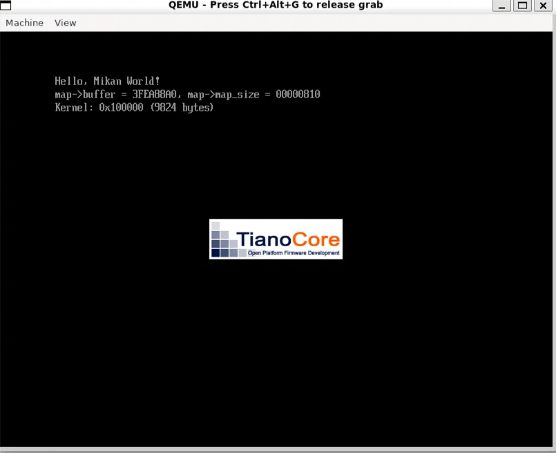

# 第3章 画面表示の練習とブートローダ

## 3a: ブートローダーからカーネルを起動する

### 全体の流れ
```
Loader.efi（UEFIアプリ）
 ① kernel.elf をディスクから読み、RAM の 0x100000 番地に置く
 ② ExitBootServices でファームウェアのサービスを手放す
 ③ カーネルの入口（Entry point）へジャンプ
kernel.elf（自作OS）
 ④ KernelMain が動く（hlt で休み続けるだけ）
```
第1章の起動の図でいう「④ ブートローダーが OS 本体を RAM に読み込んで実行する」を実施した。



画面には `Kernel: 0x100000 (... bytes)` まで表示される。カーネルは何も表示しないので、
起動できたことは画面ではなく `info registers` の `RIP=0x101011`（カーネルの中）と
`HLT=1`（hlt で休んでいる）で確認した（後述「観察」）。


### カーネル（kernel/main.cpp）
```cpp
extern "C" void KernelMain() {
  while (1) __asm__("hlt");
}
```
- `hlt`: 「止まれ」ではなく **「割り込みなどが来るまで休め」**。起こされると次の命令から再開する。
- `while (1)`: 起こされても、また `hlt` に戻って休み続けるための仕掛け。
- `extern "C"`: C++ の名前修飾をさせず、`KernelMain` という名前のまま残すため（リンカの `--entry KernelMain` で指定できるように）。

### カーネルのビルド
```bash
clang++ -O2 -Wall -g --target=x86_64-elf -ffreestanding -mno-red-zone \
  -fno-exceptions -fno-rtti -std=c++17 -c main.cpp
ld.lld --entry KernelMain -z norelro -z separate-code --image-base 0x100000 --static \
  -o kernel.elf main.o
```
- `--entry KernelMain`: 入口を `KernelMain` にする（ELFヘッダの Entry point に入る）。
- `--image-base 0x100000`: 0x100000 番地に置かれる前提でアドレスを決める。
- `-z separate-code`: 本には無いオプション。理由は後述「本どおりに動かなかった点」。
- EDK II の `build` が作るのは Loader.efi だけ。kernel.elf は別にビルドする。

### ブートローダーに追加した処理

#### ① kernel.elf を読み込む
- `GetInfo` でファイルサイズを取得し、`AllocatePages(AllocateAddress, EfiLoaderData, ページ数, 0x100000)` で **0x100000 番地を指定して** メモリを確保し、ファイルを丸ごと読み込む。
- **0x100000 を使ってよい根拠**: 第2章の memmap の Index 2 が `EfiConventionalMemory, 00100000, 700`（0x100000 から 7MB が空き）だった。

#### ② ExitBootServices
- 最新の `map_key` を渡さないと失敗する。失敗したらメモリマップを取り直して再挑戦する（第2章の問い (b) の答えそのもの）。
- これ以降、`Print` などファームウェアのサービスは使えない。

#### ③ カーネルへジャンプ
```c
UINT64 entry_addr = *(UINT64*)(kernel_base_addr + 24);
```
- ELFヘッダの先頭から24バイト目（0x18）が Entry point。`readelf -h` の「Entry point address」と同じ値。

### ELFヘッダ（readelf -h）
| 項目 | 意味 |
|---|---|
| Magic `7f 45 4c 46` | 先頭4バイト。`45 4c 46` = 文字の `ELF`（.efi の `MZ` と同じ「形式の名札」） |
| Class ELF64 / Machine X86-64 | 64ビット x86-64 用 |
| Type EXEC | 実行可能ファイル |
| Entry point address | カーネルの入口のアドレス |

---

### 本どおりに動かなかった点：ファイル内の位置とメモリ上の番地のずれ

#### 症状
`Kernel: 0x100000 (1936 bytes)` まで表示されるが、カーネルが動かない。
`info registers` の `RIP=0x3FB73016`（memmap の Index 28 = BootServicesCode、ファームウェアのコード）、`HLT=0`。

#### 原因
第3章のブートローダーは kernel.elf を **ファイルのまま** 0x100000 に置く。そのため次の関係が成り立たないと動かない。
```
Entry point ＝ 0x100000 ＋ （KernelMain がファイルの何バイト目にあるか）
```

`readelf -l` の実行可能部分（Flags `R E` の LOAD）:

| | ファイル内の位置（Offset） | 置かれるべき番地（VirtAddr） | Entry point |
|---|---|---|---|
| 本どおり（lld 14） | `0x120` | `0x101120` | `0x101120` |
| `-z separate-code` 付き | `0x1000` | `0x101000` | `0x101000` |

- 本どおりだと、KernelMain の実体はメモリ上の `0x100120` に置かれるのに、`0x101120` へジャンプしていた。
- しかもファイルが 1936 バイトなので確保は1ページ（`0x100000`〜`0x100FFF`）だけ。`0x101120` は確保すらしていない場所だった。
- 本の当時のリンカはコードをファイル内の 0x1000 バイト目に置いていたので偶然一致していた。今の lld はファイルを詰めて作るため一致しない。
- `-z separate-code` でコードがページ境界（0x1000）に置かれ、関係が成り立つようになった。
- 根本的な解決は第4章（プログラムヘッダを読んで、各部分を正しい番地に配置する）。

---

### 観察：CPU の状態を読む（QEMU モニタ `info registers`）

カーネル起動成功時:
```
RIP=0000000000101011  HLT=1  RFL=00000046  RSP=000000003fea8820
```
- `RIP=0x101011`: カーネルの中。`hlt` の **次の命令** を指している（起きたらここから再開）。
- `HLT=1`: `hlt` で休んでいる。
- `RSP=0x3FEA8820`: **ブートローダーが使っていたスタック（BootServicesData）のまま**。カーネルはまだ自分のスタックを持っていない。ExitBootServices 後はこの領域は「誰が使ってもよい」扱いなので、本来は危うい。

**RIP を memmap と照らし合わせると「CPU が今どのプログラムの中にいるか」がわかる**:

| RIP の範囲 | 中身 |
|---|---|
| `0x1010xx` | カーネル |
| `0x3E859000`〜（LoaderCode） | ブートローダー |
| BootServicesCode / RuntimeServicesCode | ファームウェア |

### 観察：機械語（objdump）
`while (1)` あり:
```
101000: push %rbp
101001: mov  %rsp,%rbp
101004: nop（詰め物）
10100e: nop（詰め物）
101010: hlt
101011: jmp 101010   ← while(1)
```
- 詰め物の nop は、ループの先頭を `0x101010`（16の倍数）にそろえるためにコンパイラが入れたもの。
- `RIP=0x101011` は、`hlt` の次のジャンプ命令を指していた。

---

### 実験：`while (1)` を外して `hlt` だけにする

予測: カーネルの中で `hlt` したまま眠り続ける（`RIP=0x1010xx`、`HLT=1`）。

機械語:
```
101000: push %rbp
101001: mov  %rsp,%rbp
101004: hlt
101005: pop  %rbp
101006: ret       ← 起こされたらブートローダーに戻る
```

結果:

| | `while (1)` あり | `while (1)` なし |
|---|---|---|
| `RIP` | `0x101011`（カーネル） | `0x3FBC72C7`（RuntimeServicesCode = ファームウェア） |
| `HLT` | `1` | `0` |
| `RFL` | `0x46`（IF=0） | `0x283`（IF=1） |
| 画面 | `Kernel: ...` まで | `Kernel: ...` まで（`All done` は出ない） |

**予測は外れた。** 推測される流れ:
1. カーネルが `hlt` で休む
2. 何かによって起こされる
3. `ret` でブートローダーに戻る
4. ブートローダーは `Print(L"All done\n")` を実行しようとするが、ExitBootServices 後なので表示されず、ファームウェアのコードの中で動き続ける

わかったこと:
- `hlt` は「休め」であって「止まれ」ではない。
- カーネルから戻ってきても、ファームウェアのサービスを手放したブートローダーにはまともにできることがない。だから `while (1)` で戻らないようにしている。
- IF=0（割り込み禁止）でも CPU が起こされることがある。通常の割り込みは IF=0 だと届かないが、NMI や SMI など IF に関係なく CPU を起こすものがある。

---

## 観察機能の候補
- **「CPU が今どこにいるか」表示**: RIP を memmap と照らし合わせ、「カーネル / ブートローダー / ファームウェア」のどこにいるかを示す。
- **スタックの位置の表示**: RSP がどの領域にあるか（カーネルが自分のスタックを持つ前後で比較）。
- **割り込みのログ**: 何が CPU を起こしたのかを記録する（QEMU の `-d int -D qemu.log` が参考になる）。
- **ELF の配置の可視化**: `readelf -l` の Offset と VirtAddr の対応を図にする（第4章の題材にもなる）。

## まだよくわからないこと
- `while (1)` を外した実験で、IF=0 なのに何が CPU を `hlt` から起こしたのか（NMI？ SMI？）。
- ExitBootServices のあと、ファームウェアのコード（RuntimeServicesCode）の中で何が起きていたのか。
- カーネルが自分のスタックを用意するのは、どの章で、どうやるのか。